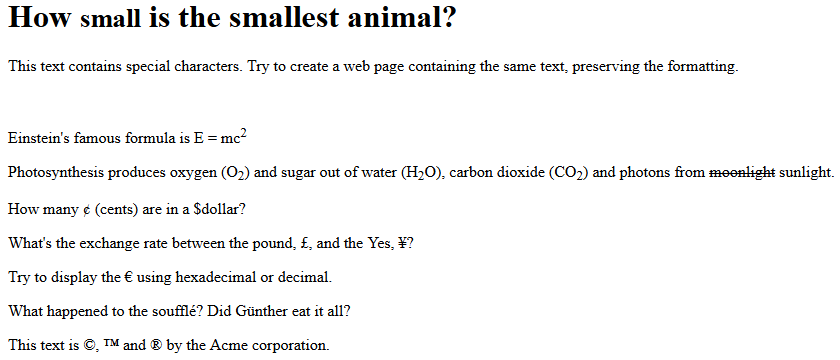
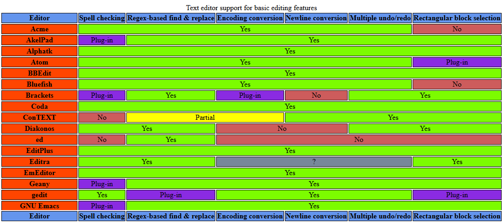

# Web Lab 01: HTML 1

Begin by forking this repository into your lab exercises namespace by clicking the ```fork``` button.


Select your lab exercises namespace as the fork destination on the resulting window.

Once forked, clone the repository to your computer by following the instructions for your editor.

Before starting on the exercises, take a look through the project and explore the files available to you.


## Exercise One &ndash; HTML Files

Using a **file explorer**, navigate to the `ictgradschool/web/html/ex01` folder within the project and open the `exercise01.txt` file using a plain text editor such as notepad, notepad++ or visual studio code. Read through the content of the document, particularly noting the HTML markup.

Now rename the file to `exercise01.html`. Double-click on the file in the file explorer and it should open in your default web browser. Though the contents are unchanged, changing the file extension has changed that default application used to open it: namely, a web browser.

Rather than display the raw text in the file (as the text editor would), the web browser interprets the syntax it finds in the file, and renders the graphical result to the screen in the browser window.

_Hint_: Windows isn’t particularly friendly about changing the file extension (The bit after the period) of files, so when you add `.html` to a  filename, you may have just changed it to `exercise04.html.txt` rather than replacing the `.txt` portion. You can make life easier by opening the `Folder and Search Options` from the file explorer and unchecking the `Hide extensions for known file types` box in the `View` tab.


## Exercise Two &ndash; Browser Forgiveness

_Note_: This exercise uses content from the `Previewing Web Content` and `Character Encodings` sections of the [`RESOURCES.md`](./RESOURCES.md) document. Please refer to this document for instruction on how to accomplish some of the tasks, and detailed explanations of content mentioned here.

Using your IDE, open the `exercise02.html` file from the  `ictgradschool/web/html/ex02` folder. Preview this file using your IDE. The web page has purposely been written to be self-documenting, so the page displayed details what the problems are in the HTML syntax used to produce the page.  Read through the displayed page, then return to your IDE and read through the HTML in the document.

Visit the [w3c HTML validator](https://validator.w3.org/nu/) and click on `Validate by File Upload`. Upload the `exercise02.html` file to check if it validates. It shouldn't. Scroll down, and read the report that is generated, detailing the problem.  You will see details reported about a lack of a character encoding, difficulty determining which parsing module to use (due to it not being able to tell which version of HTML is being used), and errors concerning how some of the tags have been written.


## Exercise Three &ndash; Cleaning up HTML

Using your IDE, make a copy of the `exercise02.html` file from the last exercise and place it in the `ictgradschool/web/html/ex03` folder. You may need to create this folder yourself. Name this copied file `exercise03.html`.

Modify this new file to correct the issues indicated in the displayed page. This will include:
+ Adding a doctype declaration
+ Indicating the character encoding
+ Closing unclosed HTML tags
+ Correcting the nesting of tags
+ Lower-casing the tags used in the document

Using the validator and method from the previous exercise, validate your new document. When the validator indicates that there are no problems, you are done.


## Exercise Four &ndash; Interesting web pages

So far the HTML content we have developed has been somewhat utilitarian: focusing on the specific purposes as various technical aspects of HTML syntax. Putting what has been learnt in the earlier exercises to use, in this exercise we focus on developing more interesting content where you will create 2 web pages, each about a historically famous New Zealander.

In the `ictgradschool/web/html/ex04` folder, you will find 2 text files which contain unformatted content that you will transform into web pages. You will also find one file html file that we have created for you - you will need to create the other one yourself. Begin by copying the contents of the appropriate text file into the `<body>` of the corresponding html file, then ensure that:

+ Paragraphs of text are appropriately tagged
+ The title element of the page is correctly set to the name of the famous person
+ Headers are set with the Page header being the largest, major sections title being slightly smaller and subsections being smaller again
+ Separate major sections using horizontal rules
+ Wikipedia citation marks ([8], [citation needed], etc) elements are removed from the text.

Validate your files and ensure that there are no errors.


## Exercise Five &ndash; Formatting

In the `ictgradschool/web/html/ex05` folder, you will find 2 text files which contain unformatted content in the form of recipes that you will transform into web pages. This time, we have not provided any HTML files for you, you will need to create them.

To complete this exercise, you will need to:
+ Create 2 appropriately named HTML files - One for each recipe
+ Copy the plain-text recipes into their respective HTML files
+ Format the recipes using HTML such that
  + The title of the recipe is shown as a large heading
  + The `Ingredients` and `Method` section headings are shown as smaller headings
  + There is a horizontal line separating each section
  + Ingredients are displayed using an unordered list
    + Quantities of ingredients should be highlighted as important
  + Method should be shown as an ordered list
    + Verbs such as **bake** and **mix** should be emphasised

Validate your files and ensure that there are no errors.


## Exercise Six &ndash; Special characters

Create the folder `ictgradschool/web/html/ex06`, and create a new HTML file named `exercise06.html` inside this folder. In this new HTML file, recreate the text pictured below as accurately as possible, using appropriate HTML tags and HTML entities.




## Exercise Seven &ndash; Displaying tabular data

Using your IDE, open the `text_editors.html` file from the `ictgradschool/web/html/ex07` folder. Locate the `Comparison of text editors` section of the document and find the unformatted tabular data. This data represents a comparison table of editor features and needs to be converted into a table.

__Hint__: Converting tabular data and merging cells can be a time consuming task if done by hand. Take some time to explore your IDE/editor macro or search and replace functionality to speed up the task.

Convert the tabular data into a table, ensuring that:
+ The caption of the table is correctly marked up
+ Row elements are grouped into the correct `tbody`, `tfoot`, and `thead` tags
+ Cells that have the same values as their neighbours are merged into a single multi-column cell (_Hint_: use the `colspan` attribute)

When complete, the table should look like the following example.

_Note_: You will **not** have to color the cells yourself, this should happen automatically when you have the table structure correct.


